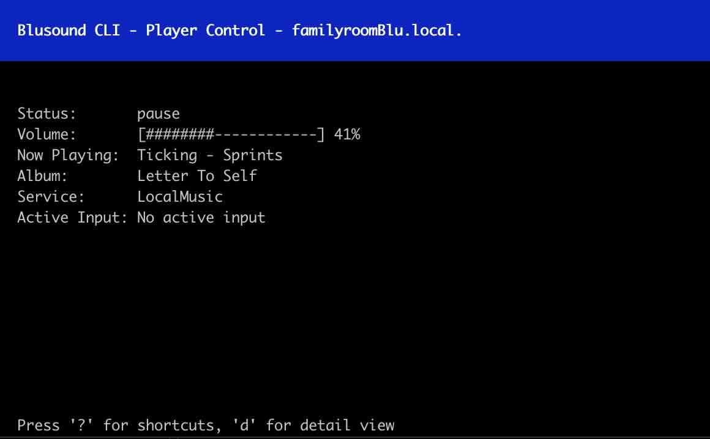

# Blusound CLI

A basic CLI interface to control Blusound streamers.




## Features

* Automatic discovery of Blusound players on the network
* Interactive player selection and control
* Volume adjustment
* Play/pause functionality
* Track navigation (skip forward/backward)
* Display of currently playing information
* Input selection for each player
* Detailed view of player status

## Requirements

* Python 3.6+

## Installation

1. Clone this repository:
   ```
   git clone https://github.com/irrelative/blucli.git
   cd blucli
   ```

2. Set up a virtual environment:
   ```
   python3 -m venv venv
   source venv/bin/activate  # On Windows use `venv\Scripts\activate`
   ```

3. Install the required dependencies:
   ```
   pip install -r requirements.txt
   ```

## Usage

Run the script using:

```
python cli.py
```


## Functionality

The Blusound CLI provides an intuitive interface to control your Blusound players:

1. **Player Discovery**: Automatically detects Blusound players on your network.
2. **Player Selection**: Choose which player you want to control.
3. **Playback Control**: Play, pause, skip tracks, and adjust volume.
4. **Input Selection**: Change the input source for each player.
5. **Status Display**: View current track information, volume level, and other player details.
6. **Detailed View**: Access comprehensive information about the player's status.

The application uses a curses-based interface for an interactive experience in the terminal.
